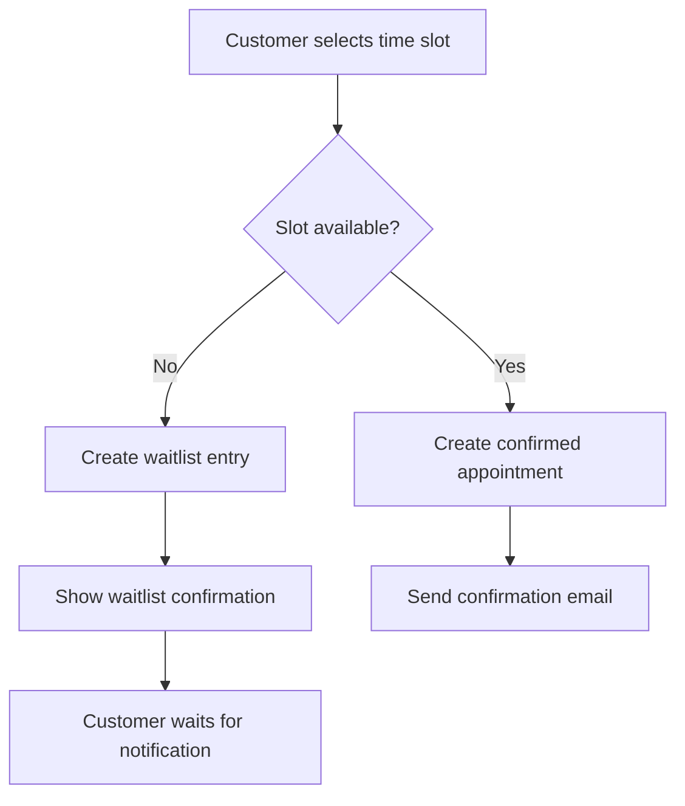
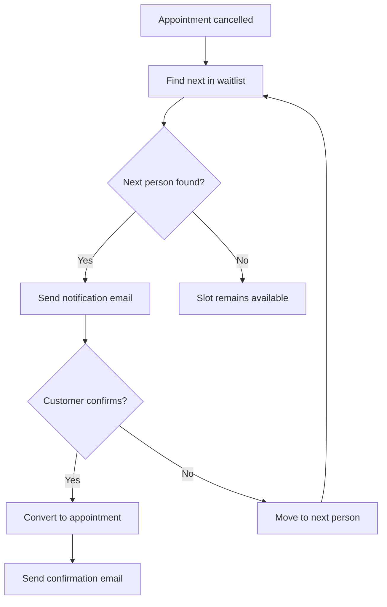

# Waitlist Management System Documentation

## Overview

The ServiceSync Waitlist Management System implements an **Overbooking with Waitlist** strategy that allows customers to book time slots even when they're already occupied. This system maximizes booking opportunities while maintaining fair queue management through a FIFO (First In, First Out) approach.

## 🎯 System Strategy: Overbooking with Waitlist

### Core Concept
Instead of rejecting bookings when time slots are full, the system:
1. **Allows overbooking** - Customers can book any time slot
2. **Assigns status** - First booking gets `confirmed`, subsequent bookings get `waitlist`
3. **Manages queue** - Waitlist entries are processed in chronological order
4. **Notifies customers** - When slots become available, customers are notified with time limits

### Why This Approach?
- **Maximizes Revenue**: No lost bookings due to full slots
- **Better Customer Experience**: Customers can always book, even if on waitlist
- **Fair Queue Management**: FIFO ensures first-come-first-served
- **Automatic Processing**: System handles notifications and conversions automatically

## 🏗️ System Architecture

### Database Schema

```prisma
model Waitlist {
  id                    String   @id @default(cuid())
  clientId             String
  serviceId            String
  employeeId           String
  requestedDateTime    DateTime
  duration             Int
  position             Int
  status               WaitlistStatus
  expiresAt            DateTime
  notificationSentAt   DateTime?
  notificationExpiresAt DateTime?
  selectedAddonIds     String[]
  totalPrice           Float?
  convertedToAppointmentId String?
  convertedAt          DateTime?
  createdAt            DateTime @default(now())
  updatedAt            DateTime @updatedAt

  // Relations
  client               User     @relation(fields: [clientId], references: [id])
  service              Service  @relation(fields: [serviceId], references: [id])
  employee             Employee @relation(fields: [employeeId], references: [id])
  convertedAppointment Appointment? @relation(fields: [convertedToAppointmentId], references: [id])

  @@index([serviceId, employeeId, requestedDateTime, status])
  @@index([status, createdAt])
}

enum WaitlistStatus {
  waiting    // In queue, waiting for notification
  notified   // Notified, waiting for confirmation
  confirmed  // Converted to appointment
  expired    // Notification expired or waitlist entry expired
  cancelled  // Manually cancelled
}
```

### Key Components

1. **Time Slot Generation** (`BookClient.tsx`)
   - Shows all time slots regardless of conflicts
   - Visual indicators for availability status
   - Real-time conflict detection

2. **Appointment Creation** (`/api/appointments/route.ts`)
   - Implements overbooking logic
   - Determines appointment status based on conflicts
   - Creates waitlist entries for overbooked slots

3. **Waitlist Management** (`/lib/actions/waitlist.ts`)
   - FIFO queue processing
   - Notification system with time limits
   - Automatic cleanup of expired entries

4. **Email Notifications** (`/lib/email.ts`)
   - Waitlist slot availability notifications
   - Confirmation emails for converted bookings
   - Professional email templates

## 🔄 Workflow

### 1. Booking Process



### 2. Waitlist Processing



### 3. Status Transitions

```
waiting → notified → confirmed
   ↓         ↓
expired   expired
   ↓
cancelled
```

## 🎨 User Interface

### Time Slot Display

Time slots are displayed with visual indicators:

- **🟢 Available**: No conflicts, can be booked immediately
- **🟡 Waitlist**: 1 conflict, will be added to waitlist
- **🔴 Full**: 2+ conflicts, disabled for booking

### Booking Dialog States

1. **Normal Booking**: Standard appointment creation
2. **Waitlist Enrollment**: Shows waitlist information and next steps
3. **Success**: Confirmation with appointment details

### Admin Interface

- **Waitlist Dashboard**: Overview of all waitlist entries
- **Queue Management**: Manual processing and cleanup
- **Statistics**: Waitlist metrics and performance

## ⚙️ Configuration

### Environment Variables

```env
# Required
NEXT_PUBLIC_APP_URL=https://your-domain.com

# Optional (for cron jobs)
CRON_SECRET=your-secret-key
```

### Waitlist Settings

```typescript
// Default configuration
const WAITLIST_CONFIG = {
  NOTIFICATION_EXPIRY_MINUTES: 15,  // Time to confirm when notified
  WAITLIST_EXPIRY_DAYS: 7,          // How long to keep waitlist entries
  MAX_CONFLICTS_FOR_FULL: 2,        // When to mark slot as full
  CLEANUP_INTERVAL_HOURS: 24,       // How often to clean expired entries
};
```

## 📧 Email Templates

### Waitlist Notification Email

**Subject**: "Your Waitlist Slot is Available - ServiceSync"

**Content**:
- Service and appointment details
- 15-minute confirmation window
- Direct booking link
- Professional ServiceSync branding

### Waitlist Confirmation Email

**Subject**: "Waitlist Booking Confirmed - ServiceSync"

**Content**:
- Confirmed appointment details
- Add-on information (if any)
- Next steps and contact information

## 🔧 API Endpoints

### Waitlist Management

```typescript
// Add to waitlist
POST /api/waitlist
{
  clientId: string;
  serviceId: string;
  employeeId: string;
  requestedDateTime: string;
  duration: number;
  selectedAddonIds?: string[];
  totalPrice?: number;
}

// Get waitlist entries
GET /api/waitlist?serviceId=xxx&employeeId=xxx&status=waiting

// Notify next in queue
POST /api/waitlist/notify-next
{
  serviceId: string;
  employeeId: string;
  requestedDateTime: string;
}

// Confirm waitlist booking
POST /api/waitlist/confirm
{
  waitlistId: string;
}

// Cancel waitlist entry
DELETE /api/waitlist/:id
```

### Appointment Creation (Modified)

```typescript
// Create appointment with overbooking
POST /api/appointments
{
  serviceId: string;
  employeeId: string;
  clientId: string;
  dateTime: string;
  status: "pending" | "waitlist";
  addonIds?: string[];
  totalPrice: number;
}

// Response includes waitlist flag
{
  appointment: Appointment;
  waitlist: boolean;
  message: string;
}
```

## 🧪 Testing

### Test Scenarios

1. **Basic Waitlist Flow**
   - Book first appointment (should be confirmed)
   - Book second appointment for same slot (should be waitlist)
   - Cancel first appointment
   - Verify second customer gets notified

2. **Notification Expiry**
   - Create waitlist entry
   - Send notification
   - Wait for expiry (15 minutes)
   - Verify next person gets notified

3. **Multiple Conflicts**
   - Book 3 appointments for same slot
   - Verify first is confirmed, others are waitlist
   - Cancel confirmed appointment
   - Verify proper queue processing

4. **Add-on Integration**
   - Book with add-ons
   - Verify add-ons are preserved in waitlist
   - Confirm booking includes add-ons

### Test Commands

```bash
# Test waitlist creation
curl -X POST http://localhost:3000/api/waitlist \
  -H "Content-Type: application/json" \
  -d '{"clientId":"xxx","serviceId":"xxx","employeeId":"xxx","requestedDateTime":"2025-01-15T10:00:00Z","duration":60}'

# Test notification
curl -X POST http://localhost:3000/api/waitlist/notify-next \
  -H "Content-Type: application/json" \
  -d '{"serviceId":"xxx","employeeId":"xxx","requestedDateTime":"2025-01-15T10:00:00Z"}'

# Test cleanup
curl -X POST http://localhost:3000/api/cron/waitlist-cleanup \
  -H "Authorization: Bearer your-cron-secret"
```

## 📊 Monitoring & Analytics

### Key Metrics

1. **Waitlist Conversion Rate**: % of waitlist entries that become appointments
2. **Average Wait Time**: Time from waitlist entry to notification
3. **Notification Response Rate**: % of customers who confirm when notified
4. **Queue Length**: Number of people waiting for each time slot
5. **Expiry Rate**: % of waitlist entries that expire

### Admin Dashboard Features

- **Real-time Queue Status**: Live view of all waitlist entries
- **Statistics Overview**: Key metrics and trends
- **Manual Processing**: Override automatic processing if needed
- **Cleanup Tools**: Remove expired entries manually
- **Export Functionality**: Download waitlist data for analysis

## 🚀 Deployment

### Production Considerations

1. **Cron Jobs**: Set up automated cleanup
2. **Email Delivery**: Ensure reliable email service
3. **Database Indexing**: Optimize for waitlist queries
4. **Monitoring**: Track waitlist performance
5. **Scaling**: Consider queue processing for high volume

### Vercel Cron Configuration

```json
{
  "crons": [
    {
      "path": "/api/cron/waitlist-cleanup",
      "schedule": "0 2 * * *"
    }
  ]
}
```

## 🔒 Security Considerations

1. **Rate Limiting**: Prevent spam waitlist entries
2. **Authentication**: Verify customer identity
3. **Data Privacy**: Protect customer information
4. **Email Security**: Prevent email spoofing
5. **Queue Integrity**: Prevent queue manipulation

## 🐛 Troubleshooting

### Common Issues

1. **Notifications Not Sending**
   - Check email service configuration
   - Verify email templates
   - Check cron job execution

2. **Queue Not Processing**
   - Verify database indexes
   - Check for deadlocks
   - Monitor cron job logs

3. **Appointments Not Converting**
   - Check notification expiry settings
   - Verify email delivery
   - Check appointment creation logic

### Debug Commands

```bash
# Check waitlist status
curl http://localhost:3000/api/waitlist?status=waiting

# Check cron job
curl -X POST http://localhost:3000/api/cron/waitlist-cleanup \
  -H "Authorization: Bearer your-cron-secret"

# Check email queue
curl http://localhost:3000/api/email/queue
```

## 📈 Future Enhancements

### Planned Features

1. **Priority Queues**: VIP customers get priority
2. **Smart Notifications**: SMS + email notifications
3. **Waitlist Analytics**: Advanced reporting and insights
4. **Mobile App Integration**: Push notifications
5. **Machine Learning**: Predict optimal waitlist sizes

### Performance Optimizations

1. **Redis Caching**: Cache frequently accessed data
2. **Database Sharding**: Scale waitlist processing
3. **Background Jobs**: Process notifications asynchronously
4. **CDN Integration**: Faster email template delivery

---

*Last updated: January 2025*
